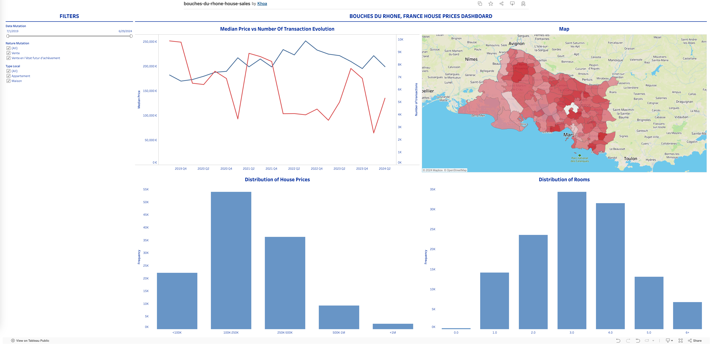

# Data Visualization: Bouches-du-Rhône Department, France House Prices Dashboard

### Context
In my journey to learn data visualization, I decided to turn theory into practice after reading chapters from *Communicating with Data*. Though insightful, I found the book a bit theoretical, so I supplemented it with Tableau tutorials ([this video](https://www.youtube.com/watch?v=KlAKAarfLRQ&t=276s) and [this video](https://www.youtube.com/watch?v=CmOAXW24y2Y)). While following the tutorial, I made some modest changes based on what I learned from the book.
We know that simply following the instruction does not enhance the competence, especially when unexpected errors occur. So, in the next phase, I pick a dataset comparable to the one I worked on previously and create the dashboard myself.

### Exploring the Dataset

I picked a dataset from the French government's open data platform, ["Demandes de valeurs foncières géolocalisées"](https://www.data.gouv.fr/fr/datasets/demandes-de-valeurs-foncieres-geolocalisees/#/information), containing real estate transactions from 2019 to the present. This dataset, updated biannually, provided a wealth of information for understanding the trend in French housing prices. In my analysis, I only use data from the Bouches-du-Rhône department in the south of the country.
 
During data exploration, I identified key transformations:

- **Data Deduplication:** Some rows were exact duplicates, so deduplication was essential for accurate analysis.
- **Unique `id_mutation` Challenge:** The column `id_mutation` is not unique. A single mutation can involve multiple properties. However, it only has one `value_fonciere` (the price), which means that the price represents the total value of all properties in the transaction. Since my analysis focuses on the property level rather than the transaction level, I chose to allocate a price to each part of a mutation proportional to `surface_reelle_bati`.
- **Property and Transaction Types:** I narrowed the scope to "Appartement" and "Maison" property types, excluding less relevant types such as "Dependance" and "Local industriel" properties. For transactions, I focused on primary sales ("Vente" and "Vente en l'état futur d'achèvement") and excluded others, such as land sales or court-ordered transaction, which could skew pricing trends.

### Data Cleaning and Transformation with DuckDB

This project presented a chance to explore **DuckDB** for data transformation instead of my usual tool, **Pandas**. DuckDB's capabilities allowed for efficient data manipulation using a familiar SQL syntax. Here’s a sample of the data cleaning workflow:

```python
import duckdb

connection = duckdb.connect()
# errors when the engine encounter an unexpected values after guessing type from the sample data
connection.execute("CREATE TABLE house_sales_data AS SELECT * FROM read_csv_auto('./data/dvf.csv', sample_size=-1)")

selected_columns = [ "id_mutation", "date_mutation", "nature_mutation", "valeur_fonciere", "adresse_numero",
    "adresse_suffixe", "adresse_nom_voie", "code_postal", "nom_commune", "id_parcelle", "type_local", 
    "surface_reelle_bati", "nombre_pieces_principales", "surface_terrain", "longitude", "latitude"]

connection.execute("CREATE TABLE house_sales_data_filtered AS"
                   f" SELECT {', '.join(selected_columns)} FROM house_sales_data"
                   " WHERE (type_local = 'Appartement' OR type_local = 'Maison')"
                   " AND (nature_mutation = 'Vente' OR nature_mutation = 'Vente en l''état futur d''achèvement')")

# Further deduplication, type conversion, and price calculation
# ...
```
### Building the Dashboard

I designed the dashboard with simplicity and clarity in mind, applying key visualization principles from *Communicating with Data*. My aim was to highlight trends and correlations without overwhelming users with information. Here are the dashboard components:

- **Median Price vs. Number of Transactions Evolution:** This dual-axis chart illustrates the trend in median prices alongside transaction volume over time, allowing users quickly identify potential correlations.
  
- **Map Visualization:** The interactive map displays median house prices by town, with detailed tooltips showing town names, median price and price per square meter. Users can click on the map to filter the house prices in specific areas.

- **Price Distribution Chart:** This histogram shows the distribution of house prices. I converted continuous pricing data to categorical bins for the histogram, making the chart easier to understand.

- **Room Count Distribution:** This histogram shows the distribution of properties by room count. To avoid outliers (properties with up to 54 rooms) skewing the histogram, I grouped values above six into a single category, following techniques from [this video](https://www.youtube.com/watch?v=CmOAXW24y2Y).

### Error encountered & Solutions
Of course, it's not funny without unexpected errors. While building the dashboard, I ran into the following problems:

- **Manual Axis Ticks:** In some charts, I noticed that the gap between the ticks in y-axis was too small, so I applied a manual configuration. While this initially resolved the issue, the ticks **shifted significantly** when filters were applied. To ensure stability, I reverted to automatic mode, which maintained consistent tick gap.
- **Updating Data Sources in Tableau:** Initially, I didn’t include the `nom_commune` column in the visualization file. After adding it, all the charts broke, as if the data source hadn’t updated correctly. When I clicked the refresh button, I encountered an error: Unexpected Error [SQLSTATE:42601]. Adding the file to the workspace a second time resolved the issue, and I removed the duplicate table afterward. This behavior was unexpected.
- **Dashboard Formatting:** When adding filters, I encountered inconsistencies in color settings. The funny thing is that I found the place to change the color, but when I closed it, I couldn't find it back.


### Results
The completed dashboard can be viewed on Tableau Public: [Bouches-du-Rhône, France House Sales Price Dashboard](https://public.tableau.com/app/profile/khoa8102/viz/bouches-du-rhone-house-sales/Dashboard). Below is a screenshot:



### Key Learnings & Skills Developed

This project strengthened my data proficiency by enabling me to move beyond tutorials and solve real-world data challenges. Key skills developed include:
- Explored DuckDB for data transformation and cleaning tasks.
- Enhanced Tableau skills with **dual-axis charts** and **custom calculated fields**, improved troubleshooting abilities.
- Applied visualization principles from *Communicating with Data*, which helped to refine clarity and improve the dashboard’s interpretability.

