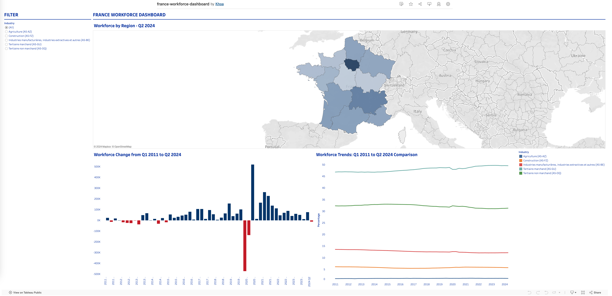

# Data Visualization: France Workforce Dashboard

### Context

To improve my skills in data visualization, I decided to turn theory into practice by analyzing workforce trends across France. Building on my previous project on [house sales prices](https://public.tableau.com/app/profile/khoa8102/viz/bouches-du-rhone-house-sales/Dashboard), I designed this dashboard to explore a more complex dataset while focusing on **data transformation** and **effective presentation**. My goal was to translate raw data into an accessible tool that could highlight trends in employment by industry and region.

### Exploring the Dataset

The dataset I chose, sourced from the [INSEE (The National Institute of Statistics and Economic Studies) website](https://www.insee.fr/fr/statistiques/series/102759768), provides quarterly workforce estimates by industry and location, covering over two decades. 

Some lines extracted from the dataset:

| Libellé  | idBank   | Dernière mise à jour | Période | 2001-T4 | 2002-T1 | 2002-T2 | 2002-T3 | ... | 2024-T2 |
| -- | -- | -- | -- | -- | -- | -- | -- | -- | -- |
| Emploi salarié en fin de trimestre - Commerce ; réparation d'automobiles et de motocycles (A17-GZ) - Ain - Série arrêtée | 001737244  | 30/03/2018 12:00    |         | 21895   | 22200   | 21736   | 22183   | ...|    | 
| Codes |            |                      |         | A       | A       | A       | A | ... | |
 
A quick look at the data revealed several transformations were needed to make it analytics-ready:

1. **Column `Libellé` Breakdown**: This column contains multiple pieces of information, such as the series name, industry, location, and a status identifier (`Série arrêtée` for discontinued series). I needed to split it into separate columns for industry and location.

2. **Wide-to-Long Transformation**: Each quarter’s data was presented in separate columns, so I had to unpivot these to create a tidy table format:
   | Industry | Region | Date   | Value | Last_Update |
   | -------- | ------ | ------ | ----- | ----------- |
   | string   | string | date   | int   | string      |

3. **Industry and Location Granularity**: At first, I realized that the employee count sometimes exceeded the population! After checking the dataset closely, I saw that it used different classification levels for industry (A5 and A17) and location (regional and departmental). In addition, I noticed that filtering for specific industries or locations on the INSEE website didn’t alter the content of the exported file!! After identifying this issue, I selected the A5 level for industry and the regional level for location to ensure a consistent and accurate analysis.

4. **Filtering Incomplete Data**: Data for some industries contains missing values, especially before 2011. I filtered out incomplete records.

### Data Cleaning and Transformation with DuckDB
I used DuckDB to streamline the data transformation process, taking advantage of SQL syntax to quickly reshape the data into a usable form.

For instance, here’s how I split the `Libellé` column  (renamed to `label`) and unpivoted the table:
```sql
connection.execute(
    "CREATE TABLE job_data_unpivot AS"
    f" (SELECT split_part(label, {label_split_character}, 2) AS industry, split_part(label, {label_split_character}, 3) AS region, last_updated_at,"
    f" unnest(array[{dates_column_str}]) AS 'date', unnest(array[{dates_value_str}]) AS 'value'"
    f" FROM job_data WHERE label != 'Codes')"
)
```

Below is the code to filter out irrelevant data, calculate quarter-over-quarter changes, and aggregate total employees across industries by quarter and region.

```sql
df = connection.execute(
    f"SELECT *, value - (LAG(value, 1) OVER (PARTITION BY industry, region ORDER BY date)) delta, SUM(value) OVER (PARTITION BY region, date) all_industries_value"
    " FROM job_data_unpivot"
    f" WHERE region IN ({regions_str})"
    f" AND industry IN ({industries_str})"
    " AND date >= '2011-01-01' ORDER BY industry, date"
).fetch_df()
```

### Building the Dashboard – Accounting for Semi-Additive Measures
An important aspect of this dataset was managing the semi-additive nature of the `Value` column, which represents the workforce count for a specific quarter, industry, and location. This value could be summed across industries and regions, but not over time. Here’s how I structured the dashboard to ensure the numbers are presented accurately:

- **Workforce by Region Map**: I filtered the data to show only the last quarter, allowing users to view the most recent workforce distribution. Here, summing by region and industry can be done with the `SUM(value)` formula.

- **Workforce Change from 2011 Q1 to 2024 Q2**: This bar chart shows changes over time by summing workforce `delta` across regions and industries. Like above, using the smallest granularity of time allows me to employ the `SUM(dela)` formula. This approach captures regional and industry workforce shifts.

- **Workforce Trend Analysis**: I calculated each industry's percentage of the total workforce per quarter using the formula `SUM(value) / SUM(all_industries)`. This calculation works across all regions or within a specific region when filtered, ensuring the dashboard provides accurate comparative insights.

Users can focus on specific industries via a filter on the left or a particular region by clicking on the map, allowing them to explore workforce data dynamically.

### Result
The completed dashboard can be viewed on Tableau Public: [France Workforce Dashboard](https://public.tableau.com/app/profile/khoa8102/viz/france-jobs/Dashboard1). Below is a screenshot:




### Key Learnings

- **Efficient Transformations in DuckDB**: DuckDB’s SQL syntax enabled me to unpivot tables quickly with `unnest` and make the data transformation process seamless.
- **Creating Meaningful Metrics**: Using window functions, I calculated quarter-over-quarter changes and total workforce by quarter and region, allowing for a more insightful analysis.
- **Handling Semi-Additive Measures**: I learned to manage semi-additive measures and determine the correct way to aggregate values across various dimensions.

This project deepened my understanding of data transformation and visualization, allowing me to present France's workforce trends in a clear, impactful way.