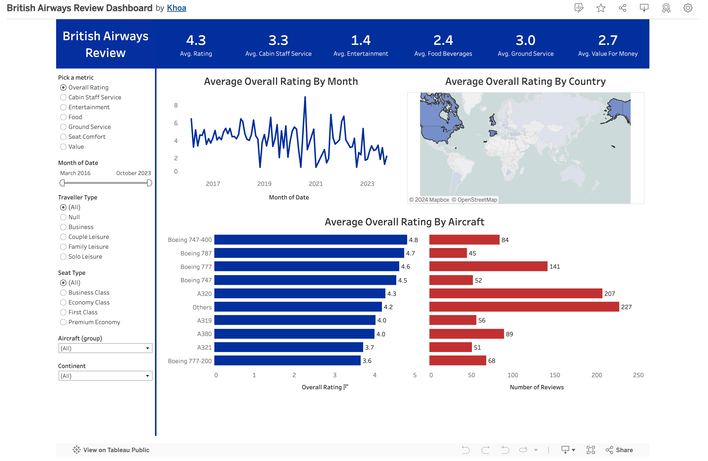

# Data Visualization: British Airways Service Review

**Source:** [YouTube Video](https://www.youtube.com/watch?v=KlAKAarfLRQ&t=276s)

In this project, I followed a YouTube tutorial to set up a Tableau dashboard for British Airways executives. The dashboard visualizes service **performance reviews**. While I applied the tutorial’s Tableau manipulations, I modified several visual elements based on the principles from the book *Communicating with Data*.

## Summary Metric
- Applied [British Airways' brand color (#0035AD)](https://www.brandcolorcode.com/british-airways) as the background for consistency with the company’s identity.

## Average Custom Metric by Month
- Consistently used blue for all charts to establish a cohesive visual theme.

## Average Custom Metric by Country
- Removed the coastline from the map to focus solely on relevant data, eliminating unnecessary complexity.
- Used the company’s blue color instead of green to maintain brand coherence across the dashboard.

## Average Custom Metric by Aircraft
- Avoided gradient coloring, as it introduces double encoding with the bar length, increasing cognitive load. Instead, I used a single shade of blue for improved clarity.
- For the number of reviews chart, I used red to align with the company’s branding.
- I added the number of reviews in the tooltips of the custom metric charts but chose not to display the custom metric in the review count chart to avoid redundant information.

# Result
My dashboard is available on Tableau Public [here](https://public.tableau.com/app/profile/khoa8102/vizzes). Below is the screenshot:

# Key Learnings
This project helped solidify my understanding of basic Tableau concepts:
- **Data Sources**
- **Categories**
  - Grouping elements, converting strings to graphical roles, and configuring date field behavior.
  - Using categories as filters.
- **Measures**
- **Parameters**
- **Calculated Fields**

Additionally, I applied several visualization principles from *Communicating with Data* to improve the clarity and effectiveness of the dashboard.
