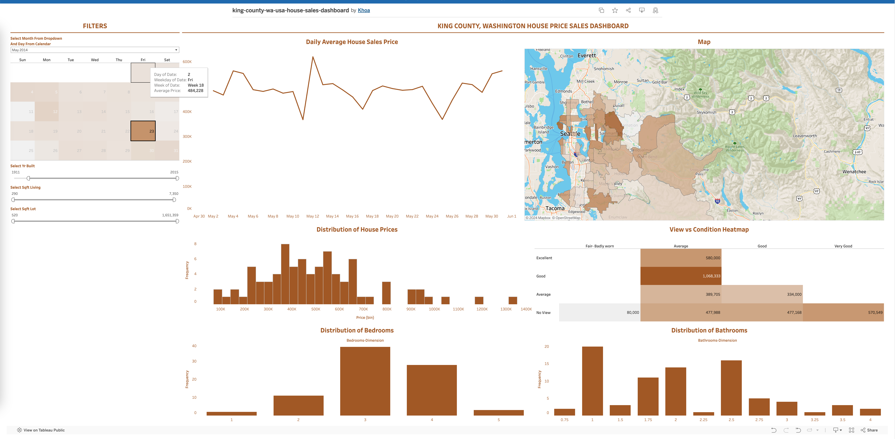

# Data Visualization: King County, Washington, USA House Sales Price

**Source:** [YouTube Video](https://www.youtube.com/watch?v=CmOAXW24y2Y)

This project showcases a Tableau dashboard focused on the **housing market in King County, Washington**. Following a YouTube tutorial, I built visualizations to analyze housing prices in the region. I customized visual elements based on best practices from [*Communicating with Data*](https://www.oreilly.com/library/view/communicating-with-data/9781098101848/), ensuring data clarity and audience relevance.

## Visual Design & Customization
- **Theme**: Applied [county color (#AD611D)](https://kingcounty.gov/en/legacy/help/governance/vendor-color) to align with King County’s branding, creating a cohesive visual identity.
- **Price Map**: Used a sequential color palette instead of a diverging one, as diverging palettes are best suited for data with a central zero point. When using a diverging palette, both low and high prices are marked by intense colors, which can be **difficult to differentiate** and may confuse readers. The sequential palette made high prices more prominent, aiding in quick pattern recognition.

## Data Transformation
- **Bedrooms and Bathrooms Histogram**: Converted bedrooms and bathrooms fields to dimensions, since they function as categorical variables in this context, despite being numeric. This conversion allowed for accurate grouping in histograms and avoided unrealistic values (e.g., 4.0–4.9 bedrooms).

## Filter Configuration
- **Calendar Filter**: Configured the date filter to apply to all dashboard charts except the daily average house sales price chart, which would otherwise display only a single data point. Included this filter on the map to visualize daily price distribution by location.
- **Global Filters**: Set up additional filters to consistently apply across all dashboard charts for seamless user interaction.

## Results
The completed dashboard can be viewed on Tableau Public: [King County, Washington, USA House Sales Price Dashboard](https://public.tableau.com/app/profile/khoa8102/viz/king-county-wa-usa-house-sales-dashboard/KingCountyHouseSales). Below is a screenshot:

## Key Skills & Learnings
This project enhanced my Tableau proficiency, particularly in:
- **Dimensions and Measures**: Converting numerical fields into dimensions to suit data visualization needs.
- **Filter Management**: Setting up a calendar and use it as a filter, configuring filters to target specific charts.

Additionally, I applied several visualization principles from *Communicating with Data* to improve the clarity and effectiveness of the dashboard.